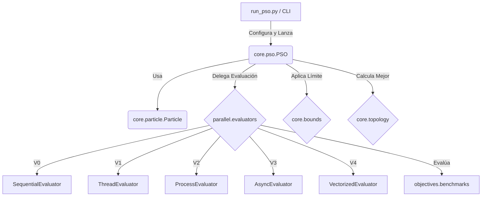

# Particle Swarm Optimization (PSO)

Este repositorio contiene una implementación completa, modular y mantenible del algoritmo Particle Swarm Optimization (PSO) en Python. Su objetivo principal es servir como banco de pruebas para comparar distintas estrategias de programación paralela y concurrente (Secuencial, Multihilo, Multiproceso, Asíncrona y Vectorizada).

## Arquitectura del Sistema

El proyecto sigue un diseño modular basado fuertemente en el **Patrón Strategy**, lo que permite intercambiar evaluadores, políticas de límites y topologías sin modificar el núcleo del algoritmo.



## Instalación

Asegúrate de tener Python 3.10 o superior. Instala las dependencias necesarias:

```bash
pip install -r requirements.txt
```
*(Dependencias principales: numpy, matplotlib, pytest).*

## Uso y Comandos Básicos

Puedes configurar el algoritmo mediante línea de comandos (CLI) o a través de un archivo `config.json`.

| Acción | Comando |
| :--- | :--- |
| **Ejecución simple (defaults)** | `python run_pso.py` |
| **Ejecución con CLI args** | `python run_pso.py --dim 5 --particles 50 --max_iter 200` |
| **Ejecución con JSON config** | `python run_pso.py --config config.json` |
| **Lanzar Benchmarks (Guardado JSON)** | `python run_benchmarks.py` |
| **Analizar y Plotear Resultados** | `python analyze_results.py` |
| **Generar Animación GIF (2D)** | `python make_viz.py` |
| **Ejecutar Pruebas (Tests)** | `pytest tests/test_pso.py -v` |

## Estrategias de Paralelismo Evaluadas
1. **V0 Secuencial**: Baseline usando bucles estándar de Python.
2. **V1 Hilos (ThreadPoolExecutor)**: Concurrencia basada en hilos. Limitada por el GIL de CPython en tareas CPU-bound.
3. **V2 Procesos (ProcessPoolExecutor)**: Paralelismo real superando el GIL, pero con penalización de overhead por la serialización (IPC).
4. **V3 Asíncrono (asyncio)**: Concurrencia cooperativa, útil exclusivamente si la función objetivo sufre de latencia de red (I/O bound).
5. **V4 Vectorizada (NumPy)**: Paralelismo implícito a nivel de datos (SIMD), ofreciendo el mejor rendimiento para tareas puramente matemáticas.